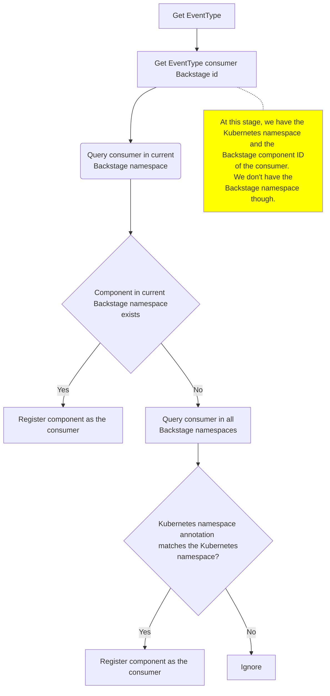

## For backstage cross namespace communication :   
---
First create an api and component in differnt namespace. 
And when get the event type it first look for in the current namespace,
if not found it looks on other namespaces. if found register the component else ignore it.

## Prerequisite
---
1. node.js
2. yarn
3. git

## procedure 
---
1. create a directory
2. setup backsatge in it with `npx @backstage/create-app@latest`
3. create manifest directory to store the resources
4. create API and Component keeping them in differnt namespace
5. push all these on github
6. start backstage and register the components and API.

## Quickstart demo 
---
[youtube link](https://youtu.be/HwZybuF0kjY)

## Diagram 
---

