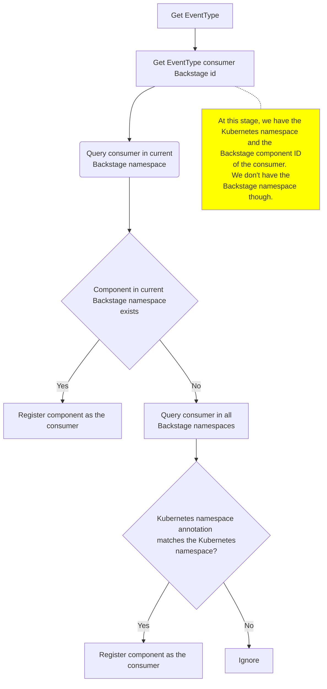

## For backstage cross namespace communication :   
First create an api and component in differnt namespace. 
And when get the event type it first look for in the current namespace,
if not found it looks on other namespaces. if found register the component else ignore it.

